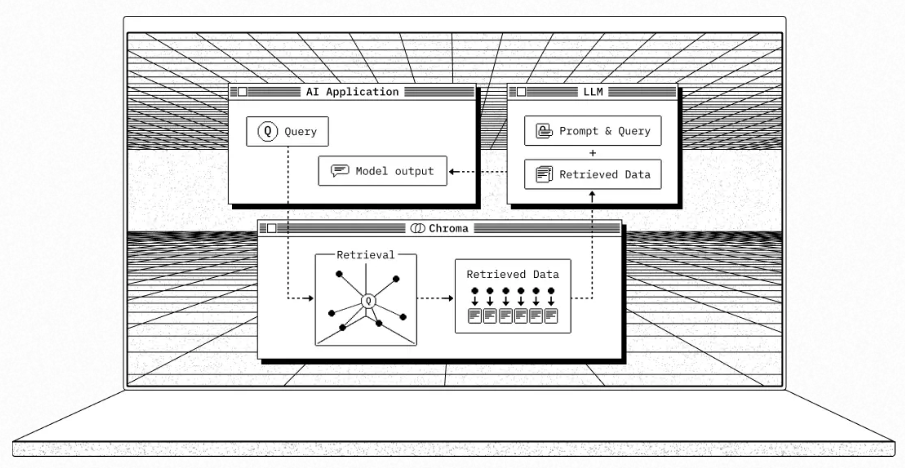

https://docs.trychroma.com/docs/overview/introduction



# What

Chroma is a popular open-source library for embedding language models. It allows you to create embeddings (numerical representations) of text data that can be used in various applications like search, clustering, and similarity matching. Chroma supports multiple language models and provides flexibility in configuring how the embeddings are generated.

Here’s a basic overview of how you can use Chroma for your vector database:

### Key Components
1. **Models**: Chroma supports different pre-trained language models that can be used to generate embeddings.
2. **Embedding Generation**: You can pass text data through these models to get embeddings.
3. **Storing Embeddings**: Once you have the embeddings, you store them in a vector database.

<generated by: qwen2.5-coder:7b>

```
python -m venv chroma
source chroma/bin/activate
```
